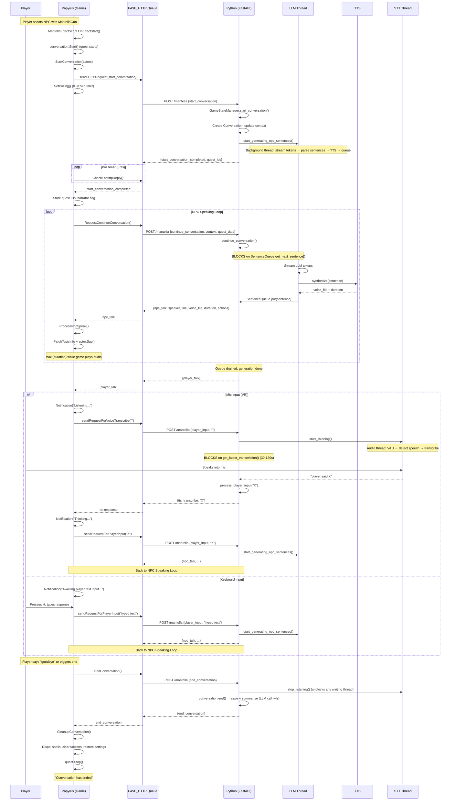

# Mantella Conversation Lifecycle

## Architecture Overview

Mantella has two halves that talk over HTTP on `localhost:4999`:

- **Game side (Papyrus)**: 5 scripts running inside the FO4VR engine. Single-threaded (Papyrus VM), but uses timers and events for async behavior.
- **Python side**: FastAPI server on uvicorn. Each HTTP request gets its own thread via `asyncio.to_thread()`. Background threads for LLM streaming, TTS, and STT audio processing.

### Key Files

| Side | File | Role |
|---|---|---|
| Papyrus | `MantellaListenerScript.psc` | Player event listener (ReferenceAlias on player). Init, load, radiant timer, hit/equip/sleep events |
| Papyrus | `MantellaEffectScript.psc` | ActiveMagicEffect on target NPC. Entry point for starting/joining conversations |
| Papyrus | `MantellaConversation.psc` | Quest script. The conversation state machine — HTTP send/receive, NPC speak, player input |
| Papyrus | `MantellaRepository.psc` | Quest script (Conditional). Settings, hotkeys, crosshair, AI packages, vision, function calling |
| Papyrus | `MantellaConstants.psc` | String constants for HTTP keys |
| Python | `src/http/routes/mantella_route.py` | FastAPI route — dispatches requests to GameStateManager |
| Python | `src/game_manager.py` | Orchestrator — start/continue/player_input/end conversation |
| Python | `src/conversation/conversation.py` | Core state machine — message thread, generation, STT, sentence queue |
| Python | `src/output_manager.py` | ChatManager — LLM streaming, sentence parsing, TTS calls |
| Python | `src/llm/sentence_queue.py` | Thread-safe producer/consumer queue between generation and HTTP threads |
| Python | `src/stt.py` | Transcriber — mic capture, VAD (Silero), Whisper transcription |
| Python | `src/conversation/conversation_db.py` | SQLite conversation storage — messages on the fly, summaries, orphan recovery |
| Python | `src/generic_npc_registry.py` | Persistent identity assignment for generic settlement NPCs |
| Python | `src/llm/client_base.py` | LLM client — streaming, vision modes, screenshot handling |

---

## Sequence Diagram



---

## Conversation Initiation (3 paths)

### A. MantellaGun (Spell Cast)
Player fires MantellaGun → casts `MantellaSpell` at target → `MantellaEffectScript.OnEffectStart(target, caster)`.

### B. Crosshair Hotkey (G key)
`MantellaRepository.OnKeyDown(startConversationkeycode)`:
- Uses `TopicInfoPatcher.GetLastActorCoords()` to find crosshair actor
- If within 1500 units: casts `MantellaSpell` from player to target
- If target already in radiant convo: casts from target to player (joins player in)
- If target in player's convo: re-casts to show remove/end menu

### C. Radiant Dialogue (Timer)
`MantellaListenerScript.OnTimer(RadiantFrequencyTimerID)`:
- If radiant enabled and no conversation running
- Finds 2 nearby NPCs within `radiantDistance` meters, within 1000 units of each other
- Casts `MantellaSpell` from Actor2 onto Actor1 (no player involvement)

### OnEffectStart Decision Tree

```
if conversation is NOT running:
    → Start new: conversation.Start() + conversation.StartConversation(actors)
elif conversationIsEnding == true:
    → "try again in a few seconds", dispel effect
elif target already in conversation:
    → Show remove/end menu
elif caster is player:
    → Show "add to conversation?" menu
else (radiant/NPC caster):
    → Directly AddActorsToConversation(actors)
```

---

## HTTP Communication Model

### F4SE_HTTP Plugin

All HTTP communication uses the `F4SE_HTTP` plugin:
- `createDictionary()` → integer handle for building JSON
- `setString/setInt/setBool/setFloat/setStringArray/setNestedDictionary` → populate the dictionary
- `sendLocalhostHttpRequest(handle, port, route)` → POST to `localhost:port/route`
- `GetHandle()` → pops next response from FIFO queue (-1 if empty, handle+100000 for errors)
- `clearAllDictionaries()` → memory cleanup

### Two Modes: Interrupt vs Polling

Set in `MantellaConversation.OnLoadGame()`:

| Mode | Platform | Mechanism |
|---|---|---|
| **Interrupt** | Flat-screen FO4 | F4SE_HTTP sends synthetic keypress `0x97` when response arrives. `OnKeyDown(0x97)` calls `CheckForHttpReply()`. |
| **Polling** | FO4VR | Timer `_HttpPollTimer` fires every 0.3s, calls `CheckForHttpReply()`. The `0x97` signal doesn't work in VR. |

### sendHTTPRequest Flow

```
if _shouldRespond:
    F4SE_HTTP.sendLocalhostHttpRequest(handle, port, route)
else:
    _shouldRespond = true   // skip this send, re-enable for next

// Set timeout
if HttpPolling (VR):
    HttpTimeout = holotapeValue * 1.6    // compensate for poll period
    HttpPeriod = 0.3
else:
    HttpTimeout = holotapeValue
    HttpPeriod = 0.5

SetPolling()   // start poll timer
```

### CheckForHttpReply

```
handle = F4SE_HTTP.GetHandle()
if handle != -1:
    cancel poll timer
    if handle >= 100000:     // error
        OnHttpErrorReceived(handle - 100000)
    else:
        OnHttpReplyReceived(handle)
else:
    SetPolling()             // keep polling
```

### Timeout

`SetPolling()` decrements `HttpTimeout` by 1 each tick. At zero: `Debug.Notification("HTTP Timeout")` → `CleanupConversation()`.

---

## The Full Message Loop

### Request/Response Protocol

**Requests (Papyrus → Python):**

| Request Type | When Sent | Key Data |
|---|---|---|
| `mantella_start_conversation` | Conversation starts | Input type (mic/text), actors (baseID, refID, name, gender, race, voice type, combat status), context (location, time, weather) |
| `mantella_continue_conversation` | After NPC speaks / after start_completed | Actors, context, topic info ID, extra actions, quest stage data |
| `mantella_player_input` | Player submits text or mic transcribe | Player text, actors, context, player state (health, rads, sneaking) |
| `mantella_end_conversation` | EndConversation() called | Just the request type |

**Responses (Python → Papyrus):**

| Reply Type | Papyrus Action |
|---|---|
| `mantella_start_conversation_completed` | Store quest IDs + narrator flag, call `RequestContinueConversation()` |
| `mantella_npc_talk` | `ProcessNpcSpeak()` — patch topic info, `actor.Say()`, wait for duration |
| `mantella_player_talk` | Prompt player for input (mic: start STT; keyboard: enable text hotkey) |
| `mantella_tts` | Transcribed voice from STT — forward as `sendRequestForPlayerInput(transcribe)` |
| `mantella_end_conversation` | `CleanupConversation()` |
| `mantella_init_completed` | Set `_shouldRespond = false` (legacy init handshake) |
| `error` | Show error notification, `CleanupConversation()` |

### Typical Cycle

```
StartConversation → Python: start_conversation_completed
  → RequestContinueConversation → Python: npc_talk
    → ProcessNpcSpeak → RequestContinueConversation → Python: npc_talk (repeat)
    → ... eventually Python: player_talk
      → STT or keyboard → sendRequestForPlayerInput → Python: npc_talk (repeat)
      → ... eventually Python: end_conversation
        → CleanupConversation → quest.Stop()
```

---

## NPC Speaking (ProcessNpcSpeak)

1. Read speaker name from response, find actor via `GetActorInConversation()` (matches display name + duplicate suffix)
2. `WaitForNpcToFinishSpeaking()` — busy-wait until previous line finishes
3. Read `lineToSpeak`, `actions`, `topicID`, `duration`
4. `RaiseActionEvent()` — process NPC actions (follow, attack, loot, use item, etc.)
5. `NpcSpeak()`:
   - `SetOverrideVoiceType(MantellaVoice)` — force Mantella voice type
   - `TopicInfoPatcher.PatchTopicInfo(topic, line)` — patch the in-memory topic text
   - `SetLookAt()` — speaker + all participants look at each other
   - `actor.Say(topic, abSpeakInPlayersHead=isNarration)` — plays the FUZ audio
   - `SetOverrideVoiceType(none)` — restore
   - `Wait(duration - 0.5)` — hold until audio finishes
6. Call `RequestContinueConversation()` again

---

## Streaming Overlap (Generation ↔ Playback)

The LLM streams token-by-token on the **generation thread**. As soon as a full sentence is detected by the parser chain, TTS is called **synchronously on that same thread**, and the `Sentence` is pushed to the `SentenceQueue`.

Meanwhile, the game's `continue_conversation` HTTP request is **blocked** in `SentenceQueue.get_next_sentence()` on its own HTTP worker thread. As soon as a sentence is put in the queue, the HTTP thread wakes up and returns it to the game.

**Result**: While the game plays sentence N (audio duration ~2-5s), the generation thread is already streaming sentence N+1 from the LLM and running TTS on it. By the time the game finishes playing and sends another `continue_conversation`, sentence N+1 is often already in the queue — near-zero wait.

---

## Multiple Actor Handling

**Participants** is a `FormList` property storing all actors in the conversation.

**Adding**: Checks for duplicates. If two actors share a display name (e.g., two "Settler" NPCs), assigns faction rank 2, 3, ... in `MantellaConversationParticipantsFaction`. `GetActorName()` appends the rank suffix (e.g., "Settler 2").

**Removing**: Removes from FormList, stops following, removes from all function factions. If < 2 participants remain, ends conversation. Otherwise reassigns AI packages.

**Speaker resolution**: Python sends speaker name → `GetActorInConversation()` matches against all Participants using `GetActorName()` (includes duplicate suffix).

### Generic NPC Identity System

Settlement NPCs with generic game names ("Settler", "Resident", etc.) get persistent unique identities via `src/generic_npc_registry.py`.

**Flow**: `Fallout4.load_external_character_info()` → checks if name is in `GENERIC_NPC_NAMES` set → `GenericNPCRegistry.get_or_create()` → returns `GenericNPCIdentity` (name, bio, voice_model).

**Identity assignment**: Uses SHA-256 hash of `ref_id` for deterministic, stable assignment:
- **Name**: picked from ~100 male + ~100 female lore-appropriate name pools
- **Voice**: assigned from `rand_f01`–`rand_f25` / `rand_m01`–`rand_m25`
- **Bio**: assembled from personality trait + occupation + backstory fragment templates

**Persistence**: JSON registry at `{save_folder}/generic_npc_registry.json`, keyed by NPC reference ID. Same settler always gets the same identity across sessions.

**Name handling**: `Character.game_name` preserves the original name ("Settler") for Papyrus communication. `Character.prompt_name` holds the assigned name for LLM context. Papyrus always sees the original game name so actor matching works.

---

## Hierarchical Memory (Memory Consolidation)

NPC memory uses a tiered system inspired by human memory consolidation — recent memories stay detailed, older ones compress into broader narratives. This gives NPCs more natural long-term memory while keeping token usage efficient.

### Memory Tiers

```
Tier 1: Raw Messages          (kept in DB, used for orphan recovery)
   ↓ conversation ends
Tier 2: Conversation Summaries (per-conversation, 1-2 paragraphs each)
   ↓ diary consolidation (7+ game days + 3+ summaries)
Tier 3: Diary Entries          (weekly first-person narrative, multiple summaries condensed)
   ↓ arc consolidation (30+ game days + 3+ diary entries)
Tier 4: Character Arcs         (monthly+ character development, multiple diaries condensed)
```

Each tier is more abstract and compressed than the one below it. When building LLM context, the system loads diary entries (older, compressed) plus recent summaries (detailed). This naturally mimics how people remember: yesterday in detail, last week roughly, last month as broad strokes.

### How It Works

**Conversation summaries** (Tier 2): When a conversation ends, the LLM summarizes it from the NPC's perspective. Stored in the `summaries` table with timestamps.

**Diary entries** (Tier 3): At conversation start, `DiaryConsolidator.maybe_consolidate()` checks two thresholds:
1. **Time**: At least N game-days since last diary entry (default: 7, configurable via `diary_interval_days`)
2. **Volume**: At least M unconsolidated summaries (default: 3, configurable via `diary_min_summaries`)

Both must be met. If a week passes with only 1 conversation, no diary is created — not enough happened. The summaries stay as-is until enough pile up.

When triggered:
1. All current summaries are combined and sent to the LLM with the `diary_prompt`
2. The LLM writes a first-person diary entry in the NPC's voice
3. The diary entry is saved to `diary_entries` table
4. Consolidated summaries are pruned from the `summaries` table

### Example

**Before consolidation** (3 separate summaries):
```
[Day 38, 2 in the afternoon] The player came by and asked about the crops...
[Day 40, 6 in the evening] We talked about the raiders hitting the supply line...
[Day 42, 10 in the morning] The player brought back the missing shipment...
```

**After consolidation** (1 diary entry):
```
It's been a rough week. The player showed up asking about the crops — tatos are
doing fine but we're short on mutfruit. Then word came in about raiders hitting
our supply line to County Crossing. I was worried sick until the player tracked
down the missing shipment and brought it back. Starting to think maybe this
settlement thing might actually work out.
```

The diary captures the NPC's emotional arc and relationships, not just facts. The LLM gets richer, more characterful context in fewer tokens.

**Character arcs** (Tier 4): After diary consolidation, `ArcConsolidator.maybe_consolidate()` checks two thresholds:
1. **Time**: At least `arc_interval_days` (default: 30 game days) since last arc
2. **Volume**: At least `arc_min_diaries` (default: 3) unconsolidated diary entries

When triggered:
1. All current diary entries are combined and sent to the LLM with the `arc_prompt`
2. The LLM writes a character arc summary — a reflective narrative about the NPC's development
3. The arc is saved to `character_arcs` table
4. Consolidated diary entries are pruned

### Key Files

| File | Role |
|---|---|
| `src/remember/arc.py` | `ArcConsolidator` — threshold checks, LLM call, save/prune |
| `src/remember/diary.py` | `DiaryConsolidator` — threshold checks, LLM call, save/prune |
| `src/remember/summaries.py` | `Summaries.get_prompt_text()` — triggers consolidation, loads all tiers |
| `src/conversation/conversation_db.py` | `character_arcs` + `diary_entries` table CRUD |
| `src/config/definitions/prompt_definitions.py` | `arc_prompt`, `arc_interval_days`, `arc_min_diaries`, `diary_prompt`, etc. |

### DB Schema

```sql
CREATE TABLE diary_entries (
    id INTEGER PRIMARY KEY AUTOINCREMENT,
    world_id TEXT NOT NULL,
    npc_name TEXT NOT NULL,
    npc_ref_id TEXT NOT NULL,
    content TEXT NOT NULL,
    game_days_from REAL NOT NULL,    -- in-game day range start
    game_days_to REAL NOT NULL,      -- in-game day range end
    summaries_from_ts REAL NOT NULL, -- real timestamp of earliest consolidated summary
    summaries_to_ts REAL NOT NULL,   -- real timestamp of latest consolidated summary
    created_at REAL NOT NULL
);

CREATE TABLE character_arcs (
    id INTEGER PRIMARY KEY AUTOINCREMENT,
    world_id TEXT NOT NULL,
    npc_name TEXT NOT NULL,
    npc_ref_id TEXT NOT NULL,
    content TEXT NOT NULL,
    game_days_from REAL NOT NULL,    -- in-game day range start
    game_days_to REAL NOT NULL,      -- in-game day range end
    diary_from_ts REAL NOT NULL,     -- real timestamp of earliest consolidated diary
    diary_to_ts REAL NOT NULL,       -- real timestamp of latest consolidated diary
    created_at REAL NOT NULL
);
```

### Context Building

`Summaries.get_prompt_text()` builds the LLM context in order:
1. Character arcs (oldest, broadest — long-term development)
2. Diary entries (older, compressed memories)
3. Recent summaries (since last diary, detailed)

All are passed under the header: *"Below is your memory of past events. Do not read these back verbatim — paraphrase naturally in your own voice if asked."*

### Settlement Public Board (Web UI)

A web page at `/diary` lets you browse NPC diary entries and recent memories — like a wasteland community bulletin board where settlers post their logs.

**Access**: `http://localhost:4999/diary?__theme=dark` (link also printed to console on startup)

**Features**:
- **Diary Entries** section: consolidated first-person NPC diary entries, ordered newest first
- **Recent Memories** section: unconsolidated conversation summaries (not yet digested into diary)
- **NPC filter**: dropdown to view a single NPC's entries
- **Refresh**: reload from DB without page refresh
- Wasteland-themed dark UI with green accent (matches Pip-Boy aesthetic)

**Implementation**: Standalone Gradio Blocks app (`src/ui/settlement_board.py`) mounted alongside the settings UI. Opens a read-only SQLite connection to the conversation DB — no writes, no interference with the running game.

---

## Vision System

NPCs can "see" the player's screen via screenshot capture, processed by an LLM.

### Vision Modes

Determined by `src/llm/client_base.py:_determine_vision_mode()`:

| Mode | Condition | Behavior |
|---|---|---|
| `DISABLED` | `vision_enabled = False` | No vision |
| `ON_DEMAND` | Vision action in `allowed_games` for this game | Vision fires only when triggered |
| `ALWAYS_ON` | `vision_enabled = True` but game not in `allowed_games` | Screenshot sent every turn |

FO4VR uses `ON_DEMAND` (set in `data/actions/vision.json`).

### Triggers (ON_DEMAND)

1. **Speech-triggered**: Player says "look at this", "check this out", etc. → `conversation.py:__is_vision_request()` detects phrase → `enable_vision_for_next_call()`
2. **Silence timeout**: Player stays silent → auto-response fires with vision enabled → NPC comments on surroundings
3. **NPC action**: LLM outputs vision tool action → `output_manager.py` intercepts → `enable_vision_for_next_call()`

### Processing Modes

| Config | Flow |
|---|---|
| `custom_vision_model = True` | Screenshot → separate vision LLM (e.g. Qwen VL) → text description → injected as `Image transcription:` into main LLM prompt |
| `custom_vision_model = False` | Screenshot → sent directly as image to main NPC LLM (requires vision-capable model) |

### Screenshot Capture

`mss` library captures the game window. For VR, this captures the desktop mirror window (usable but shows HUD elements). Vision prompt instructs the LLM to ignore HUD (gauges, compass, notifications).

---

## AI Package System

`NPCAIPackageSelector` (Conditional int on Repository) controls NPC behavior during conversation:

| Value | Behavior |
|---|---|
| -1 | Default (no special behavior) |
| 0 | Wait in place |
| 1 | Follow another NPC |
| 2 | Attack target |
| 3 | Loot items |
| 4 | Use item (stimpak/radaway) on target |
| 5 | Follow player |

Faction ranks on `MantellaFunctionSourceFaction`, `MantellaFunctionTargetFaction`, `MantellaFunctionModeFaction`, and `MantellaFunctionWhoIsSourceTargeting` encode who does what to whom.

`CauseReassignmentOfParticipantAlias()` forces AI package re-evaluation by stopping/restarting `MantellaConversationParticipantsQuest` and calling `EvaluatePackage(true)` on all participants.

---

## Quest Awareness

**Python → Papyrus**: `start_conversation_completed` includes `KEY_QUEST_IDS_TO_CHECK` — FormID array of quests Python wants stage data for.

**Papyrus → Python**: Every `continue_conversation` and `player_input` includes `BuildQuestData()`:

```
For each FormID:
    Quest q = Game.GetForm(formID)
    if completed: "QuestName:completed"
    elif stage > 0: "QuestName:running:{stage}"
```

Wire format: `"The First Step:running:10|When Freedom Calls:completed"`

Scoped per-NPC (only quests associated with NPCs in the conversation).

---

## End Conversation Flow

### EndConversation (Papyrus)

1. Sets `_hasBeenStopped = true` (stops further `RequestContinueConversation` calls)
2. Sends `mantella_end_conversation` HTTP request to Python

### end_conversation (Python)

1. Stops STT immediately (`stt.stop_listening()`) — unblocks any `player_input` thread
2. Calls `conversation.end()` — stops generation, clears queue, saves to DB, generates LLM summary (~4s)
3. Sets `self.__talk = None`
4. Returns `{mantella_end_conversation}` response

### CleanupConversation (Papyrus)

1. `conversationIsEnding = true`
2. `ClearParticipants()` — iterates all, calls `StopFollowing()`, reverts FormList
3. `ClearIngameEvent()`
4. `_does_accept_player_input = false`, `_isTalking = false`
5. Dispels `MantellaSpell` and `MantellaIsTalkingSpell` from all actors
6. Removes all participants from all function factions
7. Scans nearby actors and removes stray faction memberships (safety)
8. Stops `MantellaConversationParticipantsQuest`
9. `RestoreSettings()` — restores game settings (greeting timers, social conversation chances)
10. `Debug.Notification("Conversation has ended")`
11. `Stop()` — stops the MantellaConversation quest

### Other End Paths

- `OnDying` (listener or effect script) → `EndConversation()`
- `OnLocationChange` (player leaves radiant area) → `EndConversation()`
- HTTP timeout → `CleanupConversation()` directly (no Python request)
- HTTP error → `CleanupConversation()` directly
- Game load with stale quest → `EndConversation()` + backup `CleanupconversationTimer`

---

## Concurrency: Thread Map

### Papyrus Side (Single-Threaded VM)

Papyrus is single-threaded with cooperative multitasking. `Wait()`, timer events, and `OnKeyDown` yield control.

| Timer/Event | Purpose |
|---|---|
| `_HttpPollTimer` (0.3s) | Heartbeat — polls `F4SE_HTTP.GetHandle()` for responses |
| `RadiantFrequencyTimerID` | Attempts radiant NPC-NPC dialogue periodically |
| `DictionaryCleanTimer` (50 min) | Clears F4SE_HTTP memory to prevent leaks |
| `CleanupconversationTimer` (5s) | Safety cleanup after game load |
| `RestartLootTimer` (4s per actor) | Monitors looting NPCs for stuck behavior |

### Python Side (Multi-Threaded)

| Thread | Lifetime | What It Does | Blocking Behavior |
|---|---|---|---|
| **Uvicorn event loop** | Process | Runs asyncio event loop | Never blocks |
| **HTTP worker** (per request) | Per-request | Runs `start/continue/player_input/end_conversation` | `continue_conversation`: blocks on SentenceQueue (0-30s). `player_input`: blocks on STT (0-120s). `end_conversation`: blocks on save (~4s). |
| **Generation thread** | Per NPC turn | Streams LLM → parses sentences → calls TTS → puts into SentenceQueue | LLM streaming (seconds), TTS synthesis (seconds) |
| **STT audio thread** | While mic active | Reads audio chunks, runs VAD, transcribes | Audio queue get (0.1s timeout polling) |
| **sounddevice callback** | While mic active | OS-level audio capture | Fires on audio buffer ready |
| **Async save thread** | Short-lived daemon | Saves conversation to avoid blocking `start_conversation` | LLM summary call (~4s) |

### Critical Concurrency Scenario

`player_input` (thread A) blocks on STT. `end_conversation` (thread B) arrives concurrently:

1. Thread B: `stt.stop_listening()` → signals `_transcription_ready` event
2. Thread B: `conversation.end()` → saves, `self.__talk = None`
3. Thread B: returns `{end_conversation}` to Papyrus
4. Thread A: wakes from `get_latest_transcription()`, sees `_running == False`, returns `None`
5. Thread A: checks `self.__talk is not talk` → True (talk was ended) → discards stale response

Without the fix, thread A would block for 120s on STT timeout, then send a stale `mantella_tts` response into the F4SE_HTTP queue, corrupting the next conversation.

---

## Lock & Event Inventory

| Primitive | Location | Guards | Held Duration |
|---|---|---|---|
| `_player_input_lock` | GameStateManager | `_player_input_in_progress` bool — ensures only one STT listener | Microseconds |
| `__generation_start_lock` | Conversation | Prevents concurrent generation starts; held during `process_player_input` stop+clear | Milliseconds |
| `__gen_lock` | ChatManager | `__is_generating` bool | Microseconds |
| `__stop_generation` (Event) | ChatManager | Signals generation thread to stop consuming LLM tokens | N/A |
| `__tts_access_lock` | ChatManager | Serializes TTS calls (one synthesis at a time) | Seconds |
| `SentenceQueue.__get_lock` | SentenceQueue | Consumer serialization | Up to 30s (blocking get) |
| `SentenceQueue.__put_lock` | SentenceQueue | Producer serialization | Microseconds |
| `SentenceQueue.__more_lock` | SentenceQueue | `is_more_to_come` flag | Microseconds |
| `SentenceQueue.__cancelled` (Event) | SentenceQueue | Wakes blocked `get_next_sentence` on `clear()` | N/A |
| `Transcriber._lock` | STT | Audio buffer, speech state, transcription text | Microseconds |
| `Transcriber._transcription_ready` (Event) | STT | Signals speech-end to blocked `get_latest_transcription` | N/A |

---

## Deadlock Prevention

### Strategy: No nested cross-subsystem locks

Each subsystem has its own locks that are never held while acquiring another subsystem's lock. The lock acquisition graph has **no cycles**:

```
GameStateManager._player_input_lock   →  (never holds other locks)
Conversation.__generation_start_lock   →  (never holds queue/stt locks)
ChatManager.__gen_lock                 →  (never holds other locks)
ChatManager.__tts_access_lock          →  (never holds other locks)
SentenceQueue.__get_lock               →  __put_lock (in put_at_front only, fixed order)
SentenceQueue.__put_lock               →  (never acquires get_lock)
Transcriber._lock                      →  (never holds other locks)
```

### Escape Hatches

1. **SentenceQueue**: `__cancelled` event lets `clear()` wake a blocked `get_next_sentence()` without needing `__get_lock`. The get method polls every 0.5s checking the event.

2. **STT**: `_transcription_ready` event is signaled by `stop_listening()`, so `get_latest_transcription()` wakes immediately. Checks `_running` after every wake-up.

3. **Generation thread**: `stop_generation()` sets a stop event, polls with 15s timeout. Conversation adds a 20s hard deadline on thread join.

4. **`_player_input_lock`**: Only guards a boolean check-and-set. If another `player_input` is already in progress, the new one returns immediately (no waiting).

5. **Papyrus HTTP timeout**: `SetPolling()` decrements `HttpTimeout` each tick. At zero, force-calls `CleanupConversation()`. The conversation never hangs forever waiting for Python.

---

## State Machine Flags (Papyrus)

| Flag | Set True | Set False | Purpose |
|---|---|---|---|
| `conversationIsEnding` | `CleanupConversation()` | `LoadMantellaEvents()`, `StopConversations()` | Blocks new `OnEffectStart` with "try again in a few seconds" |
| `_hasBeenStopped` | `EndConversation()` | `StartConversation()`, `start_completed` reply | Prevents further `RequestContinueConversation` / `sendRequestForPlayerInput` |
| `_shouldRespond` | Most replies; re-enabled after skip | `init_completed` reply | One-shot skip of next HTTP send (init handshake) |
| `_does_accept_player_input` | `player_talk` reply (keyboard mode) | `CleanupConversation`, after text sent | Gates keyboard text hotkey (H key) |
| `_isTalking` | MantellaIsTalkingSpell effect start | Effect finish, 10s safety timeout | Busy-wait in `WaitForNpcToFinishSpeaking()` |

---

## The F4SE_HTTP Queue Problem

F4SE_HTTP is a **FIFO queue**. `GetHandle()` pops the next response. Stale responses from long-running threads contaminate the queue.

**Scenario before fix**: `player_input` blocks 120s on STT after conversation ends → sends stale `mantella_tts` → next conversation picks it up → `CleanupConversation()` → "Conversation has ended" (user sees 2 end messages, 3rd attempt works).

**Fix**: `end_conversation` stops STT immediately → `get_latest_transcription` returns in ms → `player_input` detects `self.__talk` changed → discards stale response. Stale response window: **120s → ~10ms**.
